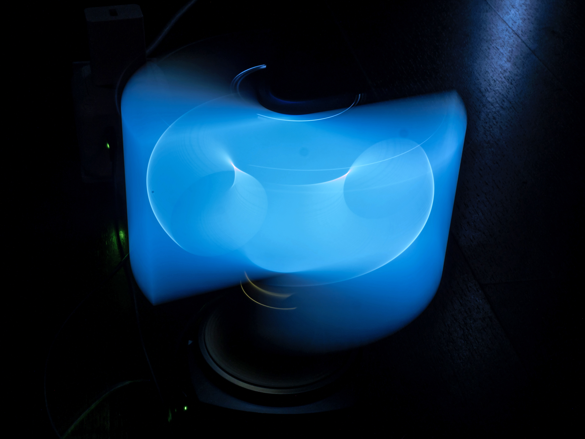
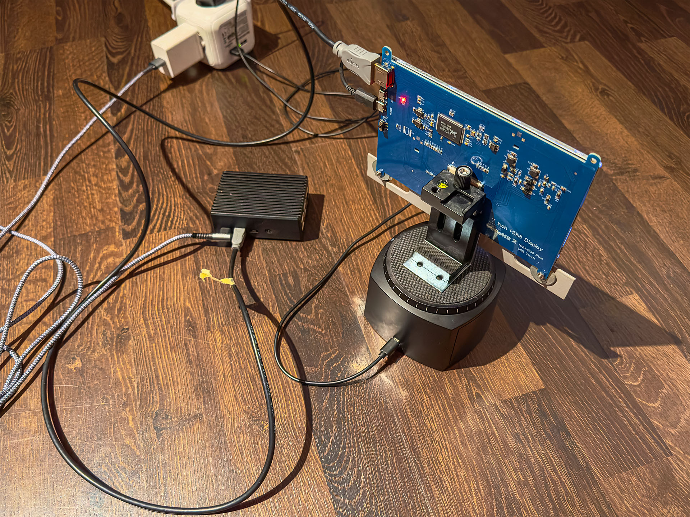
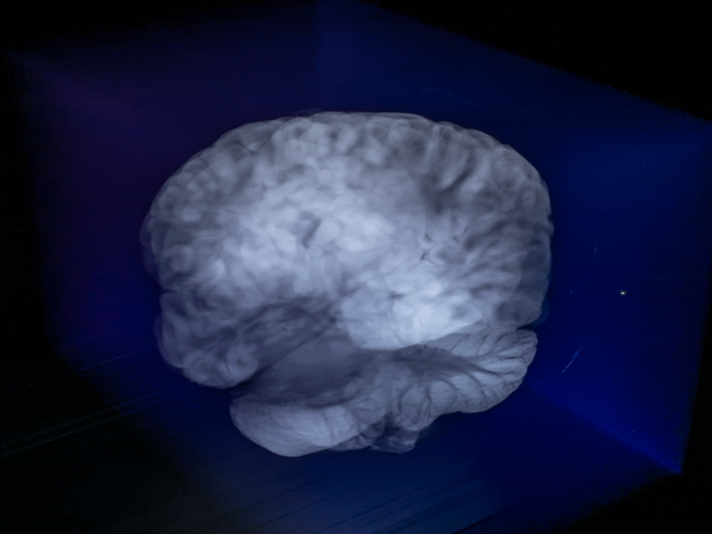

#  Volumetric Time 
## Tim Redlich

By collapsing one spatial axis and repurposing it to encode time, I aim to reveal processes as volumes.
I want to build a contraption that allows me to precisely control a screen’s position along an axis and display a sequence of images at precise locations chronologically or in an arbitrary order. A camera captures the process, and by additively stacking the images (or long-exposure photography), reveals the underlying structure, producing luminous, semi-transparent time sculptures.

**State of the project**
Experimental prototype

**Keywords**
Installation / computational photography / time-based media

---

### **Background**

Time is defined by change; without change, there is no time. 
We are in constant relative motion. Each day, we circle the axis of our planet at up to 1670 km/h (at the equator) and are flung around our star at an average speed of 107208 km/h. This star system is moving around the galactic center of the Milky Way at a speed of approximately 828000 km/h, which itself (with the entire Virgo Supercluster) is accelerating toward the Great Attractor at about 2160000 km/h. Relative to the cosmic microwave background radiation, we are moving at about 1332000 km/h toward the constellation Leo.
I thought about the four-dimensional shape we are drawing with our lifetime and how to visualize it in different ways. There is no universal fixed point to measure our motion against. Different vantage points yield different results, such as the “loopy” paths of the planets around the Earth in the Ptolemaic model or the solar analemma, which is photographed in year-long exposure images fixed to the Earth.

---

### **Process**

I have experimented with different display types, motions, and image sequences. My first rudimentary viability tests used a computer monitor that I manually slid on a piece of cloth while taking long-exposure photos. I wrote several Processing sketches of oscillating 2D shapes, which became volumetric light sculptures once moved through space.

To gain control, I built a prototype with a Raspberry Pi monitor mounted on ball-bearing sliders. The resulting images formed ghostly cuboids, since even “black” pixels emit a faint glow as LCD backlight bleeds through. A makeshift motorized rig that rotated a monitor around its center axis generated cylindrical forms. Depending on the viewing angle, the backlight bleeding shifted in color, giving the volumes a blue or red tint. In these tests, I also discovered that dropped frames appeared as dark striations, revealing lag as gaps directly in the sculpture.

Turning image sequences into 3D shapes reminded me of medical imaging techniques such as CT or MRI scans, which represent objects as layered slices. I downloaded datasets of brain scans, satellites, fruits, and electronics to “materialize” with my setup. By strapping the monitor to a linear actuator and carefully synchronizing travel speed, frame count, and exposure time, semi-transparent 3D objects emerged in-camera from the 2D scan videos. I also recorded a video and then stacked the frames additively, which gave a similar result, and allowed me to show the process in motion.

I also wrote a program that simulates stacking by placing each frame chronologically along an axis in 3D space and masking out black pixels. The physical long-exposure, however, produces a more compelling result: frames merge with slight motion blur into continuous, analog structures that interact with their environment through reflection, scattering, and refraction.

Next, I plan to test different display technologies (e.g., OLED) to reduce or control light bleeding. I also want to explore new image sources, such as Gaussian splatting, both to generate input sequences and to record and show the resulting time-volumes in 3D.

For a fully functional system, I will need a Raspberry Pi to host and playback image sequences, a microcontroller to drive a stepper motor and a lead screw, limit switches for calibration, and a trigger cable to synchronize with the camera.

---

### **References**

[Earth's rotation](https://w.wiki/8FTM), Wikipedia, The Free Encyclopedia, Aug. 2025 

[Stellar kinematics](https://w.wiki/FUWd),
Wikipedia, The Free Encyclopedia, Aug. 2025

[Galactic year](https://w.wiki/Axew), Wikipedia, The Free Encyclopedia, Aug. 2025

[Great Attractor](https://w.wiki/FUWj),
Wikipedia, The Free Encyclopedia, Aug. 2025

[Cosmic microwave background](https://w.wiki/5$Cs), Wikipedia, The Free Encyclopedia, Aug. 2025

[Medical Scan resources](https://civmvoxport.vm.duke.edu/voxbase/index.php)

[Lumafield Voyager](https://voyager.lumafield.com/projects)

